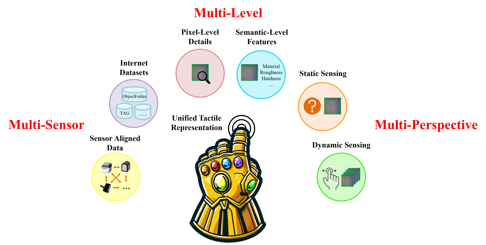
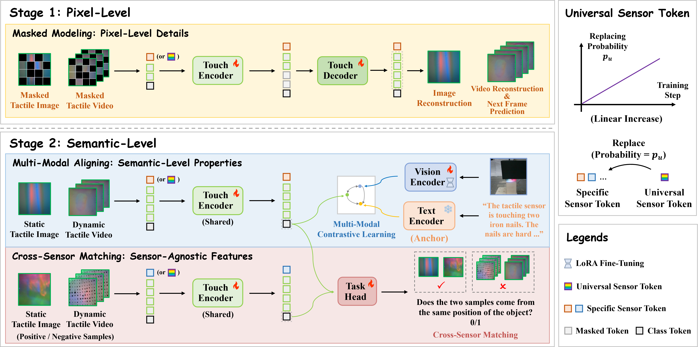

# AnyTouch: Learning Unified Static-Dynamic Representation across Multiple Visuo-tactile Sensors
The official PyTorch implementation for "*AnyTouch: Learning Unified Static-Dynamic Representation across Multiple Visuo-tactile Sensors*", ICLR 2025

**Authors: [Ruoxuan Feng](https://xxuan01.github.io/), [Jiangyu Hu](https://syc-hjy.github.io/), [Wenke Xia](https://xwinks.github.io/), Tianci Gao, Ao Shen, [Yuhao Sun](https://scholar.google.com.hk/citations?user=ShKpk00AAAAJ), [Bin Fang](https://scholar.google.com/citations?hl=zh-CN&user=5G47IcIAAAAJ), [Di Hu](https://dtaoo.github.io/)**

**Accepted by: International Conference on Learning Representations (ICLR 2025)**

**Resources:[[Project Page]()],[[ArXiv (Coming Soon)]()],[[Checkpoints]()],[[Dataset (Coming Soon)]()]**

If you have any questions, please open an issue or send an email to [fengruoxuan@ruc.edu.cn](mailto:fengruoxuan@ruc.edu.cn).

------

## Introduction

<div align="center">    

</div>

Tactile perception is crucial for humans to perceive the physical world. Over the years, various **visuo-tactile sensors** have been designed to endow robots with human-like tactile perception abilities. However, the **low standardization** of visuo-tactile sensors has hindered the development of a powerful tactile perception system. In this work, we present [**TacQuad**](), an **aligned multi-modal multi-sensor tactile dataset** that enables the explicit integration of sensors. Building on this foundation and other open-sourced tactile datasets, we propose learning unified representations from **both static and dynamic perspectives** to accommodate a range of tasks. We introduce **AnyTouch**, a **unified static-dynamic multi-sensor** tactile representation learning framework with a **multi-level** architecture, enabling comprehensive static and **real-world** dynamic tactile perception.

## TacQuad Dataset

<div align="center">    

</div>

TacQuad is an aligned multi-modal multi-sensor tactile dataset collected from 4 types of visuo-tactile sensors (GelSight Mini, DIGIT, DuraGel and Tac3D). It offers a more comprehensive solution to the low standardization of visuo-tactile sensors by providing multi-sensor aligned data with text and visual images. This explicitly enables models to learn semantic-level tactile attributes and sensor-agnostic features to form a unified multi-sensor representation space through data-driven approaches. This dataset includes two subsets of paired data with different levels of alignment:

- **Fine-grained spatio-temporal aligned data:** This portion of the data was collected by pressing the same location of the same object at the same speed with the four sensors. It contains a total of 17,524 contact frames from 25 objects, which can be used for fine-grained tasks such as cross-sensor generation.
- **Coarse-grained spatial aligned data:** This portion of the data was collected by hand, with the four sensors pressing the same location on the same object, although temporal alignment is not guaranteed. It contains 55,082 contact frames from 99 objects, including both indoor and outdoor scenes, which can be used for cross-sensor matching task.

We also use GPT-4o to generate or expand the text modality for several open-sourced tactile datasets. The TacQuad dataset and text prompt for other datasets are hosted on [HuggingFace](). 

## AnyTouch Model

<div align="center">    

</div>

AnyTouch is a unified static-dynamic multi-sensor tactile representation learning framework which integrates the input format of tactile images and videos. It learns both fine-grained pixel-level details for refined tasks and semantic-level sensor-agnostic features for understanding properties and building unified space by a multi-level structure. 

The checkpoint for AnyTouch is provided below:

|          |                        Training Data                         |     TAG (M/R/H)*      | Feel (Grasp) | OF 1.0 | OF 2.0 |                                                              |
| -------- | :----------------------------------------------------------: | :-------------------: | :----------: | :----: | :----: | :----------------------------------------------------------: |
| AnyTouch | TAG, VisGel, Cloth, TVL, SSVTP, YCB-Slide, OF Real, Octopi, TacQuad | 80.82 / 86.74 / 94.68 |    80.53     | 49.62  | 76.02  | [Download](https://drive.google.com/file/d/1L4jGUjIHNBMzOiD33Rv0jxWYKHBORD1R/view?usp=sharing) |

*M: Material   R: Roughness   H: Hardness

## Setup

This code is tested in Ubuntu 20.04, PyTorch 2.1.0, CUDA 11.8

**Install the requirements**

```
# Optionally create a conda environment
conda create -n anytouch python=3.9
conda activate anytouch
conda install pytorch==2.1.0 torchvision==0.16.0 pytorch-cuda=11.8 -c pytorch -c nvidia
pip install -r requirements.txt
```

## Linear Probing

**0. Initialization**

AnyTouch model is initialized from [CLIP-ViT-L-14-DataComp.XL-s13B-b90K](https://huggingface.co/laion/CLIP-ViT-L-14-DataComp.XL-s13B-b90K/tree/main). To use our AnyTouch model, you need to download `CLIP-ViT-L-14-DataComp.XL-s13B-b90K/config.json` first.

Then, download the [checkpoint](https://drive.google.com/file/d/1L4jGUjIHNBMzOiD33Rv0jxWYKHBORD1R/view?usp=sharing) of AnyTouch to `log/checkpoint.pth`.

**1. Data Preparation**

Download and process [Touch and Go](https://github.com/fredfyyang/Touch-and-Go/tree/main/Visuo-tactile%20contrastive%20learning), [ObjectFolder 1.0](https://github.com/rhgao/ObjectFolder/tree/main/ObjectFolder1.0), [ObjectFolder 2.0](https://www.dropbox.com/scl/fo/ymd3693807jucdxj7cj1k/AFYNXRRpNFKRchRoUzA8x0M/DATA_new?dl=0&rlkey=hr1y85tzadepw7zb5wb9ebs0b&subfolder_nav_tracking=1) and [Feel](https://sites.google.com/view/the-feeling-of-success/) datasets to `tactile_datasets/`

**2. Run Linear Probing**

To evaluate the AnyTouch checkpoint through linear probing:

```
./run_probe_TAG.sh
./run_probe_OF1.sh
./run_probe_OF2.sh
./run_probe_Feel.sh
```

## Train

**0. Initialization**

AnyTouch model is initialized from [CLIP-ViT-L-14-DataComp.XL-s13B-b90K](https://huggingface.co/laion/CLIP-ViT-L-14-DataComp.XL-s13B-b90K/tree/main). To use our AnyTouch model, you need to download `CLIP-ViT-L-14-DataComp.XL-s13B-b90K/config.json` and `CLIP-ViT-L-14-DataComp.XL-s13B-b90K/pytorch_model.bin` first.

**1. Data Preparation**

Download and process [Touch and Go](https://github.com/fredfyyang/Touch-and-Go/tree/main/Visuo-tactile%20contrastive%20learning), [VisGel](https://github.com/YunzhuLi/VisGel), [Cloth](http://data.csail.mit.edu/active_clothing/Data_ICRA18.tar), [TVL](https://huggingface.co/datasets/mlfu7/Touch-Vision-Language-Dataset/tree/main), [SSVTP](https://drive.google.com/file/d/1H0B-jJ4l3tJu2zuqf-HbZy2bjEl-vL3f/view), [YCB-Slide](https://github.com/rpl-cmu/YCB-Slide), [ObjectFolder Real](https://objectfolder.stanford.edu/objectfolder-real-download), [Octopi](https://github.com/clear-nus/octopi) and [TacQuad]() datasets to `tactile_datasets/`. The TacQuad dataset and text prompt of other datasets can be downloaded [here]().

**2. Train**

To train AnyTouch model:

```
# First Stage (MAE)
./train_stage1.sh

# Second Stage (Align + Match)
./train_stage2.sh
```

------

## Citation

```
@inproceedings{feng2025learning,
	title={Learning Unified Static-Dynamic Representation across Multiple Visuo-tactile Sensors},
	author={Ruoxuan Feng and Jiangyu Hu and Wenke Xia and Tianci Gao and Ao Shen and Yuhao Sun and Bin Fang and Di Hu},
	booktitle={The Thirteenth International Conference on Learning Representations},
	year={2025},
	url={https://openreview.net/forum?id=XToAemis1h}
}
```

